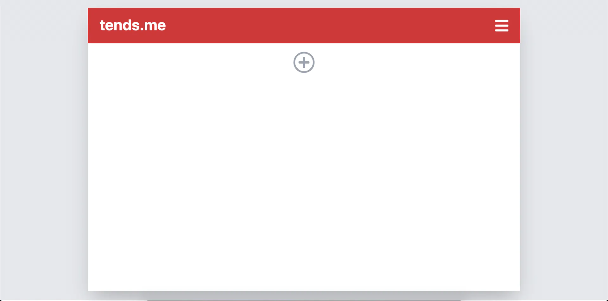
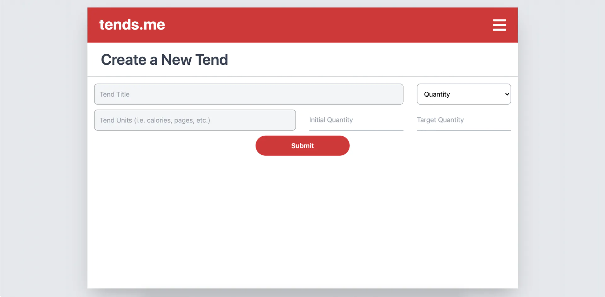

# How I Built My First SaaS Application

As my high school experience abruptly ended in the wake of COVID-19, I quickly transitioned from being a busy high school senior to spending my days feeling unfulfilled as I was stuck inside. Eventually, restlessness motivated me to take advantage of the free time that I had been granted. Instead of burning through hours by staring at the ceiling, I decided to focus on developing the habits that I had always desired. 

In pursuit of control over my habits, I found myself always keeping track of several quantities at once: calories consumed, pages read, hours fasted, etc. Furthermore, I'd always be managing different quantities in different locations: one app for timing my fasts, another app for storing calories consumed, the 'Notes' app for tracking the number of pages I had read... While this was not a major inconvenience, I couldn't help but imagine a central dashboard for managing all of my quantities. 

Fast-forward: I'm halfway through the winter term at my university where my courseload is relatively light and many COVID restrictions are still in place. I get a notification from the egghead.io Discord server advertising a club for web developers of varying skill levels. The goal for this club is to have each member develop individual SaaS applications using similar tech stacks. I was hooked; I had spent the summer learning React, Next.js, Tailwind, and Typescript, and it looked like I would finally have the opportunity to apply that knowledge.

What would I develop? A central dashboard for those who, like me, are looking to keep track of their habits. This dashboard would display widgets called "tends" (short for tendencies) that could be customized by the user according to what habit the user was looking to keep track of. Furthermore, my application would display trends for each tend so that the user knows whether they are headed in the right direction with their habit building.

Here's how I've worked to bring that idea to life.

## Design

As members of this Portfolio Project Club, we each committed to following the [Readme Driven Development](https://tom.preston-werner.com/2010/08/23/readme-driven-development.html) methodology. The first step of writing a Readme file before doing any coding seemed too simple to be effective, but it ended up being incredibly useful as, otherwise, I would have been trying to store all the information about implementation and functionality in my head.

The step that naturally followed for me was to hop into Figma and start designing the layout of the application based on the functionality described in the Readme. The Readme acted as a space for me to spill all of my ideas onto, but, because I didn't expect to implement all of those features within the timespan set by the club, I really only wanted to use Figma to design the application's foundation.


## Getting Started With Implementation

With the functionality and visuals of my application already created, it was finally time for me to set up my project and begin implementing my ideas. I began by using [Create Next App](https://nextjs.org/docs/api-reference/create-next-app) to get started with Next.js, then configured TypeScript.

### TypeScript Configuration
```js
{
  "compilerOptions": {
    "target": "es5",
    "lib": [
      "dom",
      "dom.iterable",
      "esnext"
    ],
    "allowJs": true,
    "skipLibCheck": true,
    "strict": true,
    "strictNullChecks": true,
    "forceConsistentCasingInFileNames": true,
    "noEmit": true,
    "esModuleInterop": true,
    "module": "esnext",
    "moduleResolution": "node",
    "resolveJsonModule": true,
    "isolatedModules": true,
    "jsx": "preserve"
  },
  "include": [
    "next-env.d.ts",
    "**/*.ts",
    "**/*.tsx"
, "src/pages/trends/[tendId].js"  ],
  "exclude": [
    "node_modules"
  ],
}
```

Notice that I'm using `strict` and `strictNullChecks` in my TypeScript configuration. I really wanted this project to be an opportunity for me to become better with TypeScript, so I decided to challenge myself with strict mode.

To style my components according to my Figma design, I also added and configured Tailwind. Unlike TypeScript, Tailwind is a technology that I'm confident with, so it took me no time to implement a foundation for my application that I was satisfied with.



And with a tend:


## Worries

While I felt confident in making the website look the way I wanted it to, I also felt a lingering sense of insecurity regarding the structure of my application. Firstly, I've never created something on the scale of what I had in mind for this project. My web development career has so far consisted of a lot of *learning* and not as much *doing* (unfortunately). Secondly, before this project, I've had little to no experience with implementing backend features. Thus, I couldn't help but worry about the components of my application needing to be majorly refactored when it came time to bring in the backend (as it turns out, this was not the case).

## Creating Tends with a Form

The next step in the process of implemention was to create a form that took in the information necessary to create a tend. I knew each tend would have a different "type" depending on the habit that was being tracked by the user, and, for the first iteration of this application, I had only planned on two options for tend type: quantity and timer. The creation of a quantity tend would take in an intital quantity, a target quantity, and the units of the quantity (i.e. calories), and the creation of a timer tend would take in the target hours and minutes for the timer. Thus, the inputs of the tend creation form needed to be dependent on the type selected by the user. 

I am aware of the existence of libraries that make managing forms easier in React, but I decided to implement this form without those libraries. Perhaps,as I expand the types of tends available to the user, I will refactor the form code to use one of those libraries.

### Create Tend Form Component Structure
```jsx
...

export default function CreateTendForm() {

    ...

    const [type, setType] = useState("");

    ...

    return (
        <div>
            ...

            <form
                className="grid grid-cols-8 p-4 gap-x-4 md:gap-x-8"
                autoComplete="off"
                onSubmit={(e) => handleSubmit(e)}
            >
                ...

                {/* Select the Tend Type */}
                <select
                    name="type"
                    className="mb-3 col-span-8 md:col-span-2"
                    id="type"
                    onChange={(e) => {
                        setType(e.target.value);
                    }}
                    required
                >
                    <option value="">-- Pick a Tend Type --</option>
                    <option value="quantity">Quantity</option>
                    <option value="timer">Timer</option>
                </select>
                
                {type === "quantity" && (
                    <div className="col-span-8 grid grid-cols-8 gap-x-4 sm:gap-x-8">
                        {/* Form content for quantity tend type */}
                        ...
                    </div>
                )}
                {type === "timer" && (
                    <div className="col-span-8 grid grid-cols-8 gap-x-4 sm:gap-x-8">
                        {/* Form content for timer tend type */}
                        ...
                    </div>
                )}
            </form>
        </div>
    );
}
```

Blank tend creation form:


Tend creation form with "quantity" type selected:



## Backend

Now that I had created mediums for tend creation and display, I needed to store and fetch data. As previously mentioned, I have very little experience with backend development. However, [React2025](https://react2025.com/) made this process as painless as possible for me. The React2025 tutorial walks through building an application that stores feedback for a user's sites. My application aims to store data for a user's tends. At a high level of abstraction, my application is very similar to that which is created in the React2025 tutorial. Thus, I was able to implement the features from the React2025 tutorials with minor tweaks.

## Firebase

The first step to building out the backend was to set up Firebase.

### Firebase Initialization
```js
import firebase from 'firebase/app';
import 'firebase/auth';
import 'firebase/functions';
import 'firebase/firestore';

if (!firebase.apps.length) {
  firebase.initializeApp({
    apiKey: process.env.NEXT_PUBLIC_FIREBASE_API_KEY,
    authDomain: process.env.NEXT_PUBLIC_FIREBASE_AUTH_DOMAIN,
    projectId: process.env.NEXT_PUBLIC_FIREBASE_PROJECT_ID
  });
}

export default firebase;
```

## Authentication

Setting up authentication with Firebase was easier than I could have ever imagined it would be. The React Context Hook below provides every component in the application with both user data and methods to sign in and sign out.

```js
import React, { useState, useEffect, useContext, createContext } from "react";
import firebase from "./firebase";
import { createUser } from "./db";

const authContext = createContext();
export function AuthProvider({ children }) {
    const auth = useProvideAuth();
    return <authContext.Provider value={auth}>{children}</authContext.Provider>;
}
export const useAuth = () => {
    return useContext(authContext);
};
function useProvideAuth() {
    const [user, setUser] = useState(null);
    const [loading, setLoading] = useState(true);
    const handleUser = (rawUser) => {
        if (rawUser) {
            const user = formatUser(rawUser);
            const {token, ...userWithoutToken} = user;
            createUser(user.uid, userWithoutToken);
            setLoading(false);
            setUser(user);
            return user;
        } else {
            setLoading(false);
            setUser(false);
            return false;
        }
    };
    const signinWithGitHub = () => {
        setLoading(true);
        return firebase
            .auth()
            .signInWithPopup(new firebase.auth.GithubAuthProvider())
            .then((response) => handleUser(response.user));
    };
    const signinWithGoogle = () => {
        setLoading(true);
        return firebase
            .auth()
            .signInWithPopup(new firebase.auth.GoogleAuthProvider())
            .then((response) => handleUser(response.user));
    };
    const signout = () => {
        return firebase
            .auth()
            .signOut()
            .then(() => handleUser(false));
    };
    useEffect(() => {
        const unsubscribe = firebase.auth().onAuthStateChanged(handleUser);
        return () => unsubscribe();
    }, []);
    return {
        user,
        loading,
        signinWithGitHub,
        signinWithGoogle,
        signout,
    };
}
const formatUser = (user) => {
    return {
        uid: user.uid,
        email: user.email,
        name: user.displayName,
        provider: user.providerData[0].providerId,
        photoUrl: user.photoURL,
        token: user.za
    };
};
```

## Creating, Reading, Updating, and Deleting Tends


